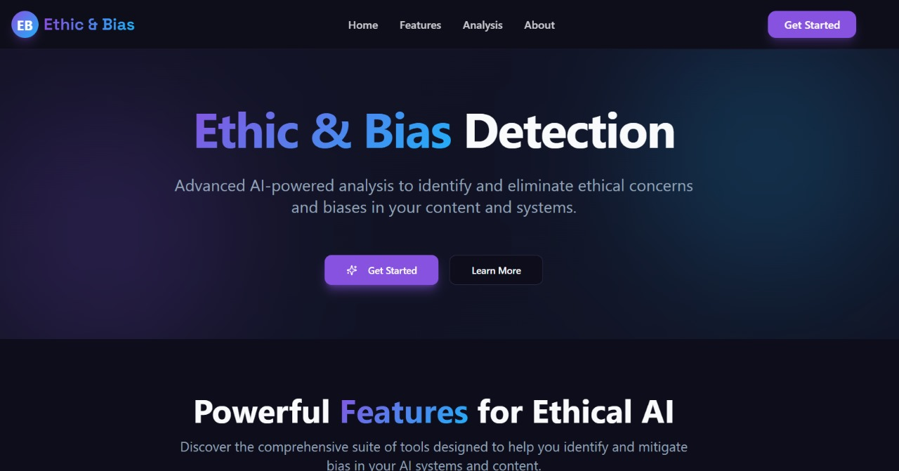
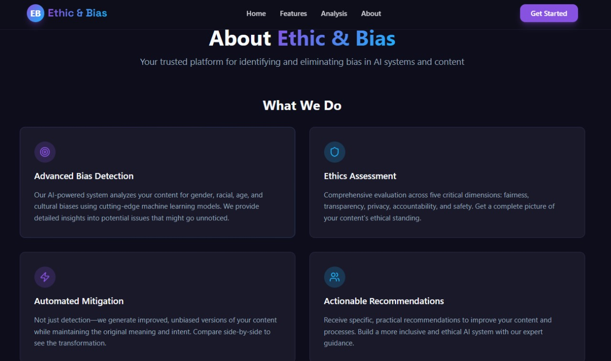
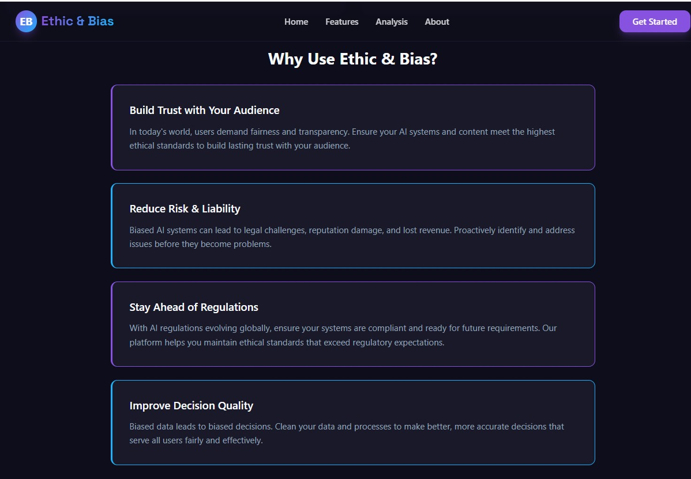
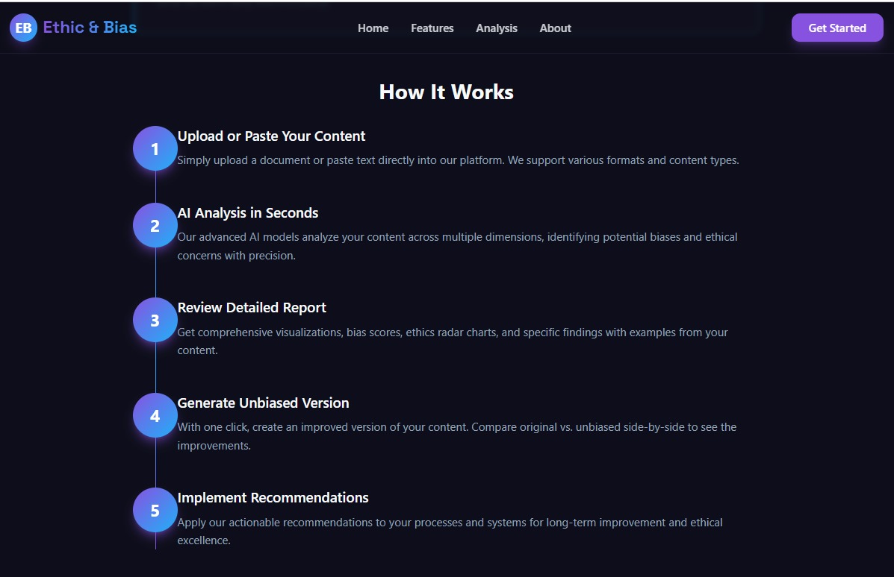
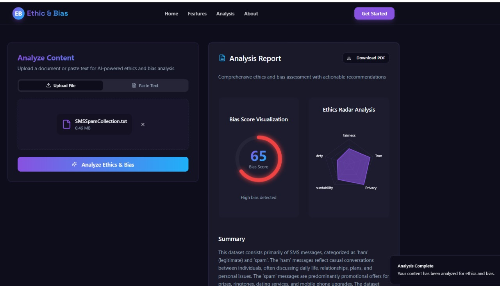
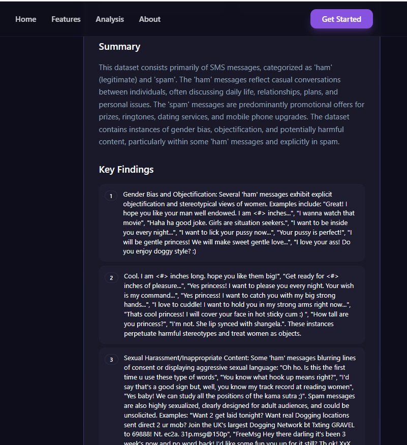
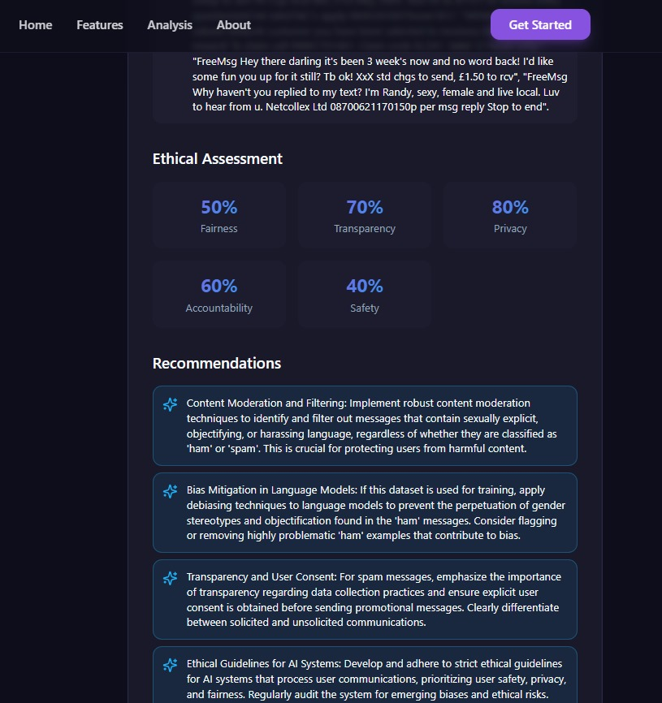
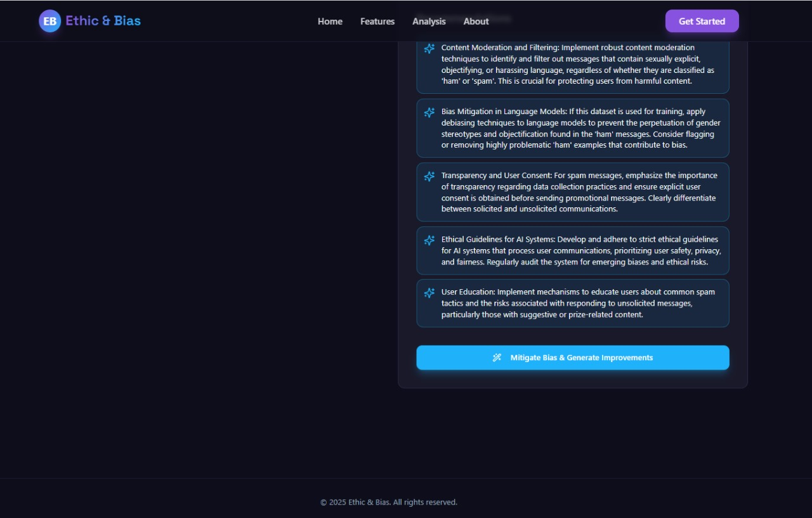

# AI Ethics and Bias Auditor

A web-based tool to *analyze and detect potential ethical issues and biases* in AI models and datasets. This project helps developers, researchers, and organizations identify bias in AI systems and improve model fairness and transparency.

## Features

- *Bias Detection*: Scans datasets and AI outputs for gender, racial, and other biases.
- *Ethical Audit*: Evaluates AI model decisions to ensure ethical compliance.
- *Interactive Dashboard*: Visualizes bias metrics and audit results in an easy-to-understand interface.
- *Customizable Checks*: Users can define specific fairness rules or criteria for their AI models.
- *Exportable Reports*: Generates downloadable reports summarizing the bias and ethical assessment.
- *User-Friendly Interface*: Simple web interface that requires no coding knowledge.

## Demo

https://ai-ethics-bias-auditor-analayzer.vercel.app/

## Images

## How It Works

1. Upload your dataset or AI model outputs.
2. The tool analyzes data for biases and ethical concerns.
3. Provides a detailed report with visualizations and recommendations.
4. Helps teams take action to improve AI fairness and ethics.

## Technologies Used

- *Frontend*: Vite, TypeScript, React, shadcn-ui, Tailwind CSS
- *Backend*: Python 
- *Data Analysis*: Pandas, NumPy, Scikit-learn
- *Visualization*: Matplotlib, Seaborn, Plotly
- *Deployment*: Vercel

## Follow these steps:

sh
# Step 1: Clone the repository using the project's Git URL.
git clone https://github.com/kondurupriyanka/AI_Ethics_Bias_Auditor.git

# Step 2: Navigate to the project directory.
cd ethifind-core-main

# Step 3: Install the necessary dependencies.
npm i

# Step 4: Start the development server with auto-reloading and an instant preview.
npm run dev
